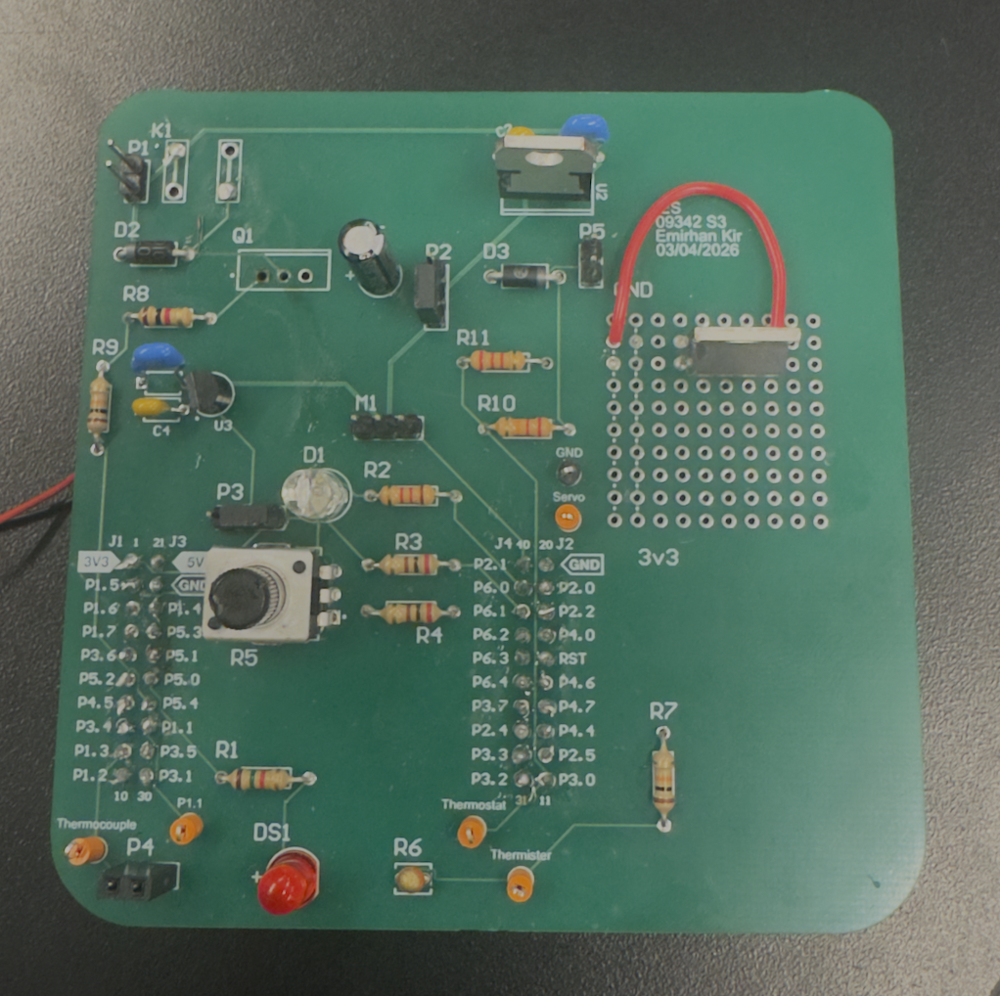
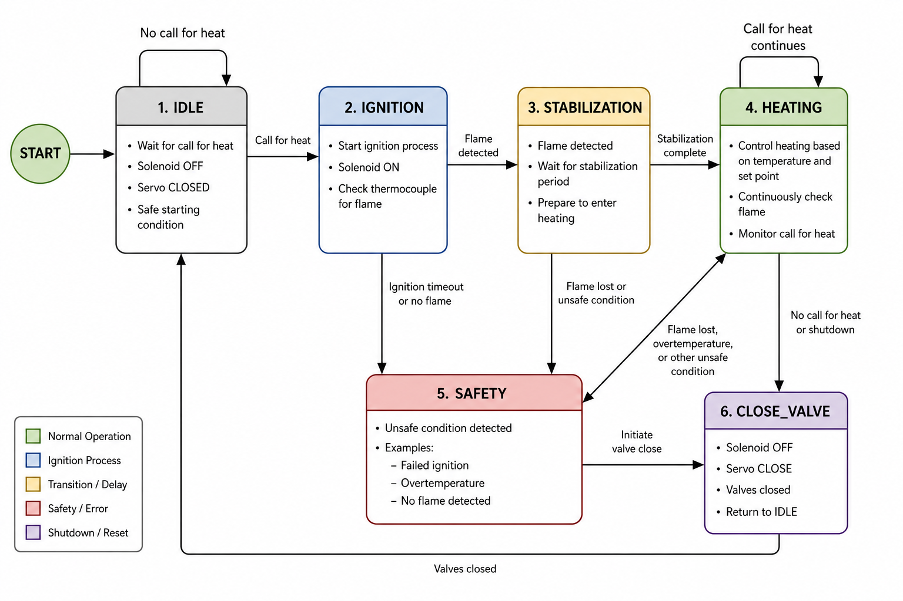
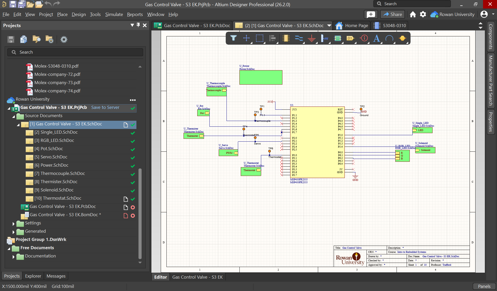
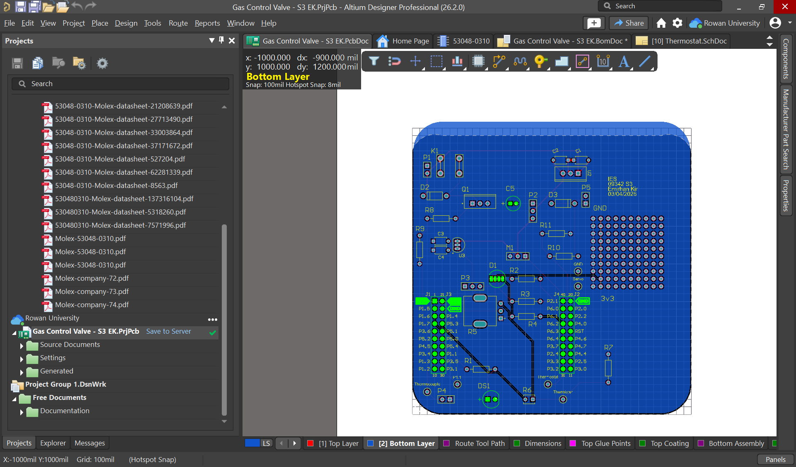
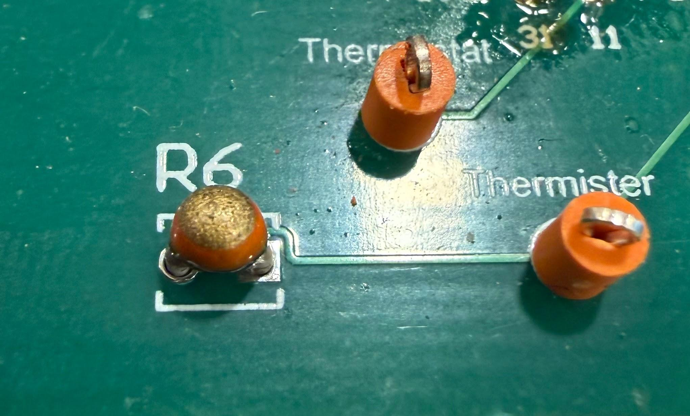
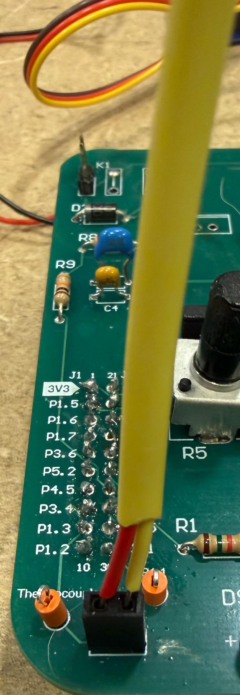
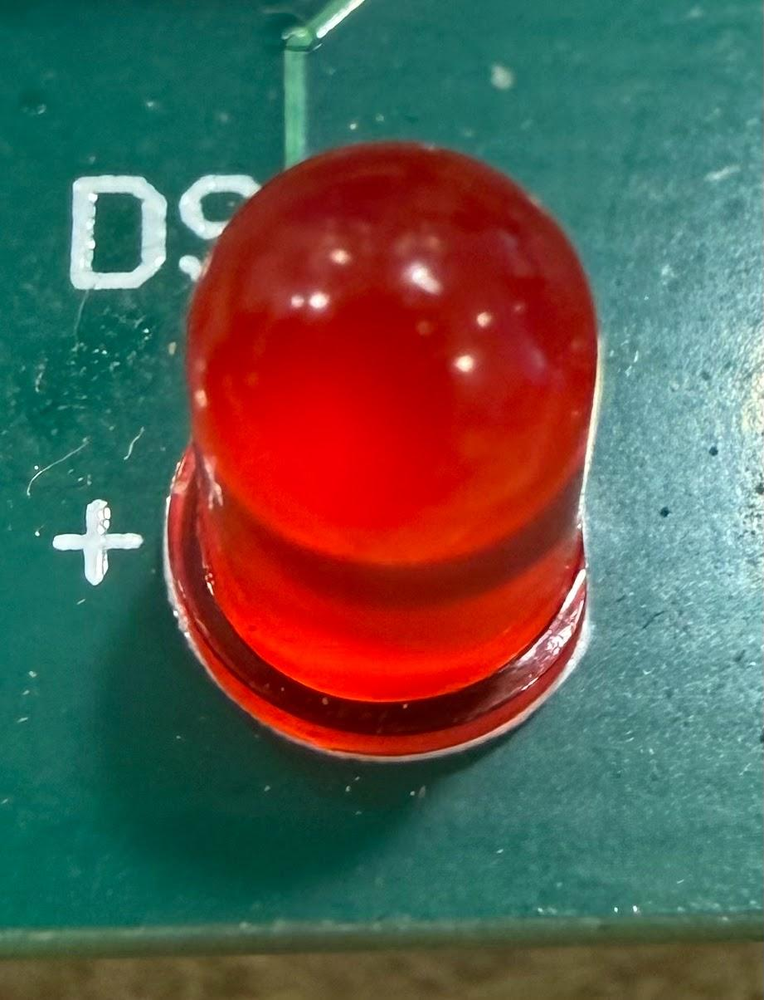
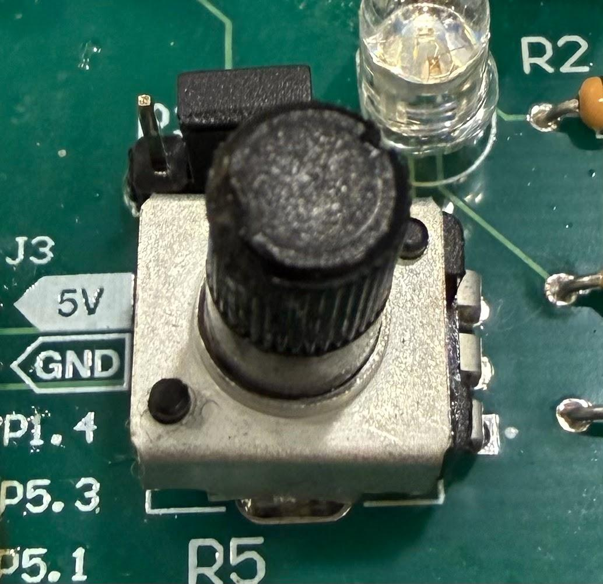
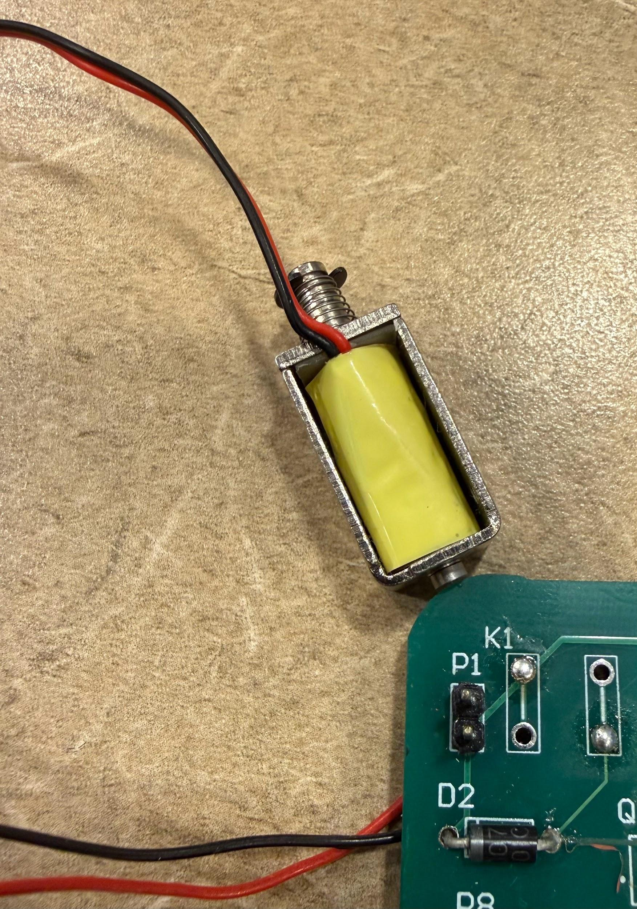
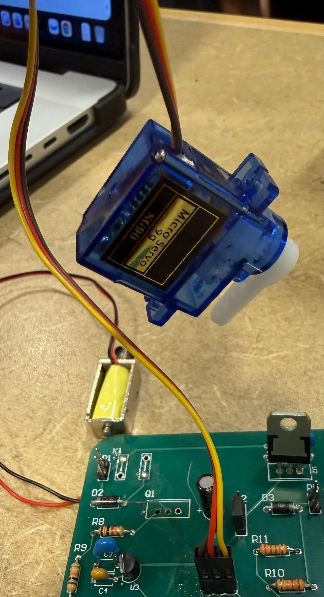

# Gas Control Valve System

A six state embedded controller for automated gas ignition, temperature regulated heating, and fail safe shutdown, built around the MSP430FR2355 with a custom PCB.



Team project for Introduction to Embedded Systems, Rowan University, Spring 2026.
Team: Emirhan Kir, Xavien Phillips, James Arozamena.

## What it does

The system waits for a thermostat call for heat, opens the pilot solenoid and checks for flame using a thermocouple, confirms ignition, then regulates a main valve (servo) against a user set temperature until the call for heat ends or an unsafe condition is detected. If flame is lost, ignition fails three times, or internal temperature exceeds a threshold, the system forces both valves closed and returns to a safe idle state. Status is reported over UART to an ESP8266 for remote monitoring, and an RGB LED plus a single status LED show the current state at a glance.

## State machine



| State | Behavior |
|---|---|
| IDLE | Valves closed, waiting for a call for heat |
| IGNITION | Solenoid opens, thermocouple checked for flame, retries up to 3 times |
| STABILIZATION | Short delay after flame confirmation before entering heating |
| HEATING | Servo modulates the main valve against the potentiometer set point |
| SAFETY | Forces valves closed on overheat, exits once temperature drops |
| CLOSE_VALVE | Shuts both outputs and returns to IDLE |

## Hardware

- MSP430FR2355 LaunchPad, custom PCB (99mm x 99mm), designed in Altium Designer
- Servo motor as the main gas valve, solenoid as the pilot valve
- Thermistor for internal temperature, thermocouple (amplified through the MSP430's onboard SAC) for flame detection
- Potentiometer for the temperature set point, thermostat input for call for heat
- RGB LED and single status LED for visual state feedback
- ESP8266 Wi-Fi module for remote status reporting over UART





## Firmware structure

Each peripheral has its own driver pair (`.h`/`.c`) under `src/`, so each part could be brought up and tested in isolation before integration:

```
src/
  ADC/            shared ADC driver, interrupt-driven read plus a polling variant used during early bring-up
  Servo/          PWM control for the main valve
  Solenoid/       GPIO on/off control for the pilot valve
  Thermistor/     temperature sensing
  Thermocouple/   flame detection, reads the SAC-amplified signal
  Thermostat/     call-for-heat input, routed to a status LED
  Potentiometer/  temperature set point input
  RGBLED/         PWM-driven state indicator
  IndicatorLED/   single status LED
  UART/           console echo channel plus the ESP8266 Wi-Fi reporting channel
  Behavioral/     main.c, the full six-state integration; ADCmain_component_test.c, the pre-integration bring-up test
```

GPIO was used for simple on/off outputs (solenoid, status LED), PWM for outputs needing variable control (servo, RGB LED), ADC for the analog sensors, and UART for status reporting.

## Testing approach

Every component was brought up and verified individually with a multimeter or by direct pin toggling before being wired into the full state machine.

<table>
<tr>
<td><br/>Thermistor, voltage rises with applied heat</td>
<td><br/>Thermocouple, tested with 3.3V to simulate a flame</td>
</tr>
<tr>
<td><br/>Ignition state LED, confirmed on thermostat call</td>
<td><br/>Potentiometer, verified against RGB brightness before wiring to set point</td>
</tr>
<tr>
<td><br/>Solenoid, GPIO-driven pilot valve switching</td>
<td><br/>Servo, full 180 degree sweep for main valve position</td>
</tr>
</table>

Final demo confirmed: valve control, ignition detection, flame monitoring, LED status feedback, safety state behavior, valve shutdown behavior, and UART/Wi-Fi communication.

## Notable debugging and design tradeoffs

- **UART pin conflict**: UART needed P1.6/P1.7, which had an accidental thermistor trace on the bottom PCB layer. Cutting it risked damaging the board, so UART and Wi-Fi were tested through back channels instead. A future revision reserves those pins from the start.
- **Thermocouple signal amplification**: the raw thermocouple output was too small for the ADC to read reliably, so the MSP430's onboard Smart Analog Combo (SAC) amplifies the signal (33x gain) before conversion.
- **Solenoid isolation**: as a higher power switching output, the solenoid circuit was kept physically separated from the sensitive analog sensor traces to avoid noise coupling.
- **Fail-safe default**: both valves default closed on power-up and on any unsafe condition (flame loss, failed ignition, overheat), rather than defaulting open.

Full writeup, including requirements, PCB layout decisions, applicable standards (NFPA 54, UL/IEC 60730, IEC 60073), and a first-principles reflection on what would change in a second revision, is in [`docs/Project_Report.pdf`](docs/Project_Report.pdf) and [`docs/PCB_Design_Considerations.pdf`](docs/PCB_Design_Considerations.pdf).

## Acknowledgements

Russell Trafford, for guiding the project and the embedded systems concepts behind it. Karl Dyer and Michelle Frolio, for support with the Altium schematic and PCB design process.
